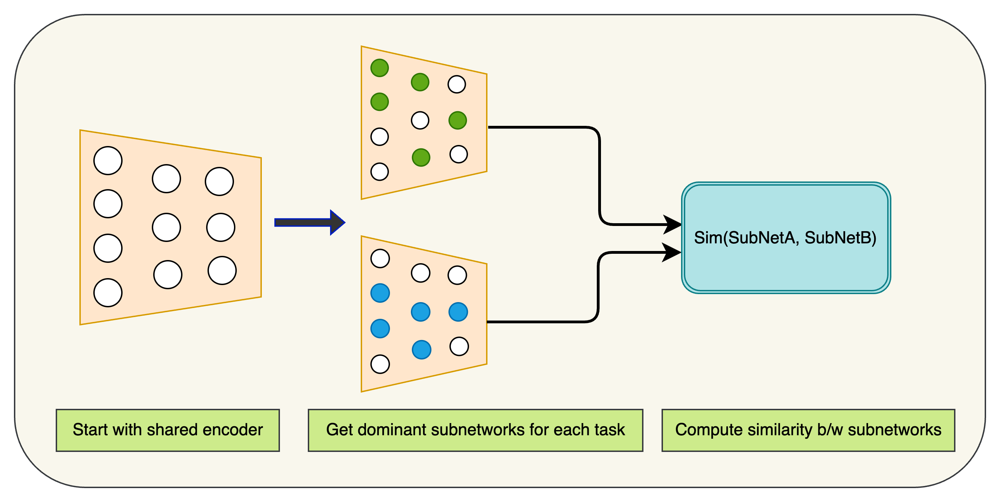

# Meta-Sparse: Efficient Task-Relationship Estimation With Dominant Subnet Structures

This repository contains code for our project Meta-Sparse, done as part of CS 330: Deep Multi-Task and Meta-Learning. The goal is to be able to measure task-similarity efficiently with no end-to-end training.


## Description

Deep multi-task learning involves training a single neural network to handle multiple tasks by leveraging commonalities and shared structure between tasks. An important notion in this regard is that of task similarity- if we could know in advance which tasks are similar, and/or which tasks are unrelated/dissimilar, we could leverage this structure to select tasks to co-train our multi-task network on, allowing it to maximize the amount of information it can reuse across tasks. 

This becomes especially relevant when computational costs are prohibitive since one would have to train over all possible combinations of task groupings and select the grouping with the best co-training performance.

Our method draws inspiration from model pruning literature. Intuitively, _**tasks having strong relationships should exhibit similar dominant sub-network structures within the shared encoder**_. We use a SNIP-like criterion (no training required!) to get importance scores that give us dominant subnetworks and compute the similarity between these task-specific subnetworks to quantitatively estimate the similarity between tasks.

Our [report](https://github.com/nikil-ravi/meta-sparse/blob/main/Efficient_Task_Relationship_Estimation_with_Dominant_Subnet_Structures-1.pdf) and [poster](https://github.com/nikil-ravi/meta-sparse/blob/main/330%20project.pdf) has further discussion of methods and results.


<div align="center">
  
  <p>An overview of our approach to calculate Task Similarity.</p>
</div>


## Prerequisites
### Datasets
For NYU-V2, please download here:\
https://drive.google.com/file/d/11pWuQXMFBNMIIB4VYMzi9RPE-nMOBU8g/view

For CityScapes, please download here:\
https://drive.google.com/file/d/1WrVMA_UZpoj7voajf60yIVaS_Ggl0jrH/view

For Tiny-Taskonomy, please refer to the following page for instructions:\
https://github.com/StanfordVL/taskonomy/tree/master/data

## Train Baseline
To train the baseline/unpruned network, run:
```
python3 launch_training.py --dataset [DATASET] --method baseline --dest [DEST]
```
Example:
```
python3 launch_training.py --dataset nyuv2 --method baseline --dest "/data/"
```
## Create Pruned Model
To generate sparsified model from pretrained checkpoint or from scratch, run:
```
python3 create_pruned_net.py --dataset [DATASET] --num_batches [NUM_BATCHES] --method [METHOD] --ratio [RATIO] --dest [DEST]
```
Example:
```
python3 create_pruned_net.py --dataset nyuv2 --num_batches 50 --method disparse_static --ratio 90 --dest "/data"
```
## Train Sparsified
To train the sparsified network generated in the above step or use dynamic sparsity training, run:
```
python3 launch_training.py --dataset [DATASET] --method [METHOD] --ratio [RATIO] --dest [DEST]
```
Example:
```
python3 launch_training.py --dataset nyuv2 --method disparse_dynamic --ratio 90 --dest "/data"
```
Available options for method are: disparse_static, disparse_pt, disparse_dynamic
## Evaluate
To evaluate the sparsified model, run:
```
python3 eval_pruned_net.py --dataset [DATASET] --method [METHOD] --ratio [RATIO]
```
Example:
```
python3 eval_pruned_net.py --dataset nyuv2 --method disparse_static --ratio 90
```
### Pretrained Models
Pretrained sparsified models can be downloaded here: https://drive.google.com/drive/folders/1wHKdjXkiOQjiKJGkXdUlvBe2oOQzFkJY?usp=sharing

## IoU Analysis
To perform the Mask IoU Analysis we mentioned in the Discussion section of the paper, you may refer to iou_analysis.py and iou_visualize.ipynb.
To run iou_analysis.py:
```
python3 iou_analysis.py --dataset [DATASET]
```
Example:
```
python3 iou_analysis.py --dataset nyuv2
```

### Computing similarity scores

```
python static_similarity.py
```

Refer to json2tab.py for script to generate all results as a tsv output.

## Results
<div align="center">
  
  Results on NYU-v2.
</div>
<div align="center">
  
  Results on Cityscapes.
</div>
<div align="center">
  
  Results on Tiny-Taskonomy.
</div>
<div align="center">
  
  IoU on Tasks Across Backbone Layers.
</div>

## Acknowledgement
Some dataloading and evaluation code is from:
https://github.com/sunxm2357/AdaShare

## Citations
If you find this repo useful to your project or research, please cite our paper below:

@inproceedings{sun2022disparse,\
  title={DiSparse: Disentangled Sparsification for Multitask Model Compression},\
  author={Sun, Xinglong and Hassani, Ali and Wang, Zhangyang and Huang, Gao and Shi, Humphrey},\
  booktitle={Proceedings of the IEEE/CVF Conference on Computer Vision and Pattern Recognition},\
  pages={12382--12392},\
  year={2022}
}
